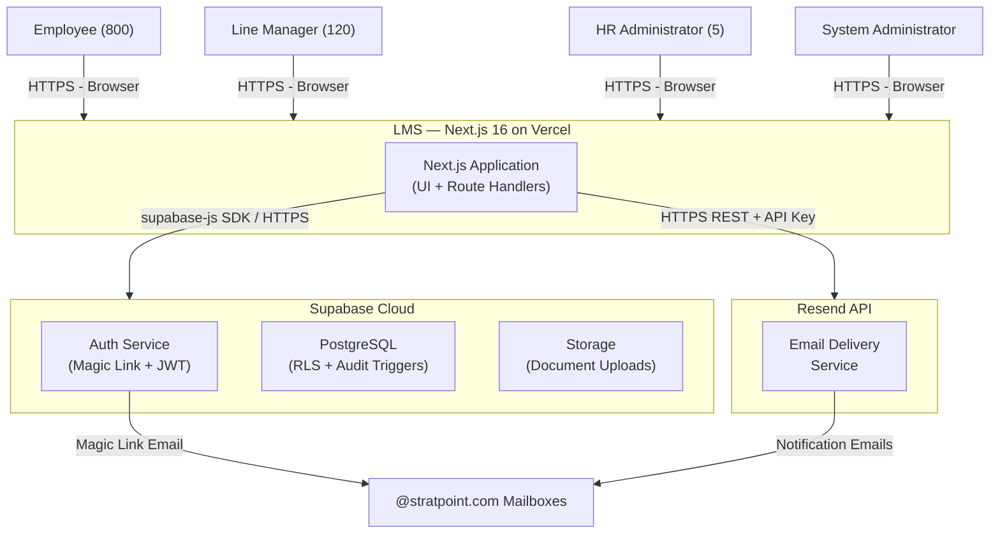
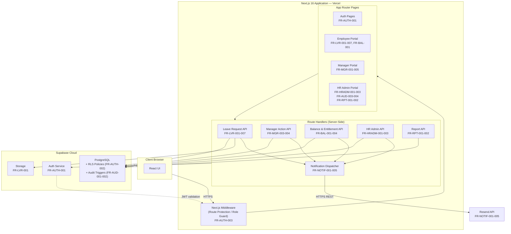
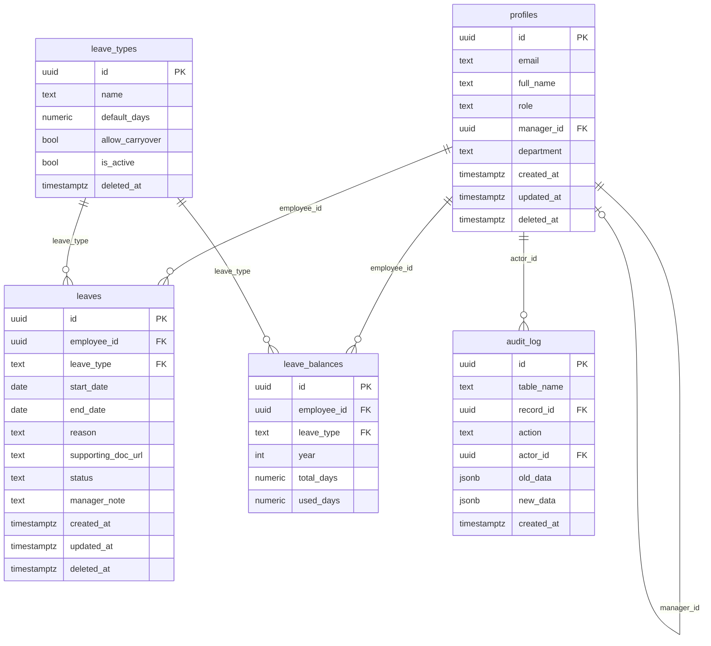
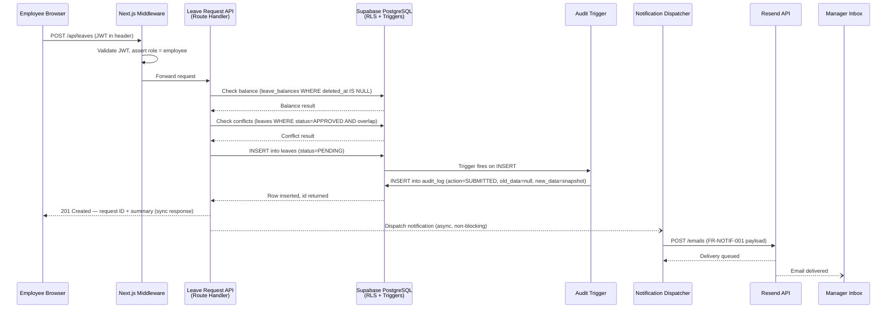
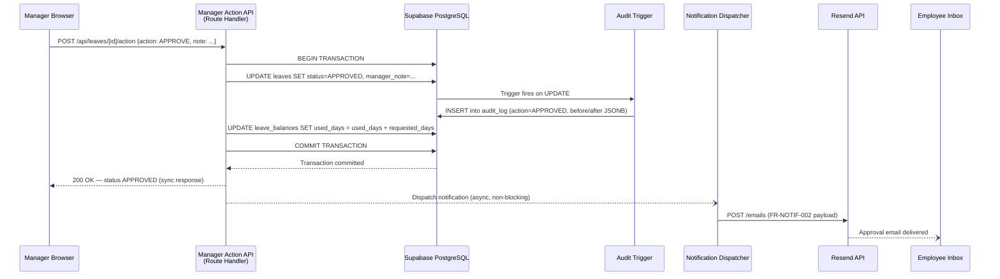
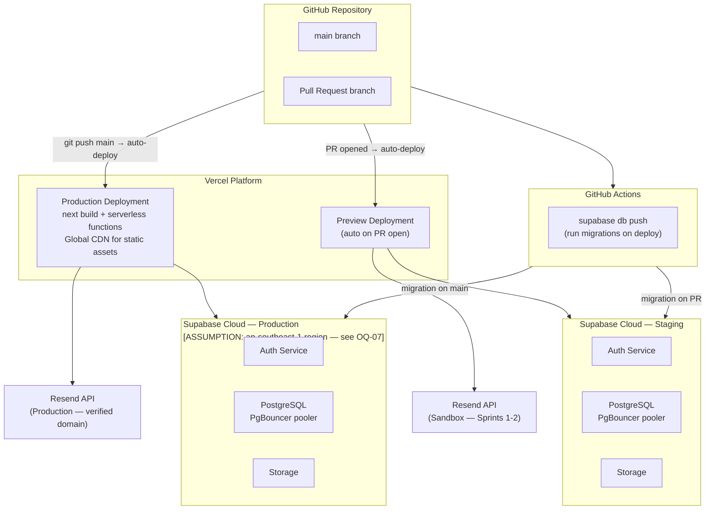

# Architecture Document: Leave Management System — Meridian Corp

---

## 1. Document Metadata

| Field | Value |
|---|---|
| **Project** | Leave Management System (LMS) — Phase 1 |
| **Version** | v1.0 |
| **Date** | 2026-05-13 |
| **Author** | Solution Architect |
| **Source PRD** | PRD-LMS-MC-v1.0 (2026-05-12) |
| **Source BRD** | BRD-LMS-MC-v1.0 — *referenced in PRD but not provided; BRD-dependent constraints are flagged* |
| **Client** | Meridian Corp |

---

## 2. System Overview

The Leave Management System is a cloud-hosted, browser-based web application that replaces Meridian Corp's email-and-Excel leave process for 800 employees across 3 offices. It provides four role-differentiated interfaces — Employee, Line Manager, HR Administrator, and System Administrator — covering the full leave lifecycle: request submission, manager approval, entitlement management, audit logging, and reporting.

The system follows a **full-stack monolith with BaaS backend** architecture style. A single Next.js 16 application deployed to Vercel serves both the React UI (App Router pages) and the REST API (Route Handlers). All persistence, authentication, and file storage are delegated to Supabase Cloud (managed PostgreSQL + Auth + Storage). Transactional email is handled by the Resend SaaS API. There is no separately deployed backend service; the API is co-located with the frontend in the same Vercel deployment, as prescribed by PRD Section 2.

### System Context



---

## 3. Component Breakdown

### Component Summary

| Component | Responsibility | Interface | PRD Reference |
|---|---|---|---|
| **Auth Pages** | Magic link request and callback handling; domain validation error display | Browser UI | FR-AUTH-001 |
| **Next.js Middleware** | Intercepts every request; redirects unauthenticated users to login; blocks cross-role route access | `middleware.ts` (Next.js edge) | FR-AUTH-003 |
| **Employee Portal** | Leave submission form, working-day preview, balance display, conflict warning, request history list and detail, self-cancellation | Browser UI (React Server + Client Components) | FR-LVR-001 to 007, FR-BAL-001 |
| **Manager Portal** | Pending approvals list with badge count, request detail view, approve/reject actions, team calendar | Browser UI (React Server + Client Components) | FR-MGR-001 to 005 |
| **HR Admin Portal** | All-requests view with filters and CSV export, entitlement grid, leave type management, status override, audit log viewer, reports | Browser UI (React Server + Client Components) | FR-HRADM-001 to 003, FR-AUD-003, FR-AUD-004, FR-RPT-001, FR-RPT-002 |
| **Leave Request API** | Create, read, and cancel leave requests; working-day calculation (Mon–Fri); conflict detection against existing approved requests | REST Route Handler — `/api/leaves` | FR-LVR-001 to 007 |
| **Manager Action API** | Approve or reject a leave request; triggers atomic balance deduction on approval; dispatches notification | REST Route Handler — `/api/leaves/[id]/action` | FR-MGR-003, FR-MGR-004, FR-BAL-003 |
| **Balance & Entitlement API** | Read per-employee balances; HR Admin individual entitlement edits; CSV bulk import with pre-apply validation | REST Route Handler — `/api/balances` | FR-BAL-001 to 004 |
| **HR Admin API** | Leave type CRUD (add, edit, deactivate); all-requests query with multi-dimension filter; CSV export; status override with audit logging | REST Route Handler — `/api/admin/*` | FR-HRADM-001 to 003 |
| **Notification Dispatcher** | Fire-and-forget async function that posts to Resend API for all five notification types; logs delivery failures; implements retry | Internal module — called from Route Handlers | FR-NOTIF-001 to 005 |
| **Report API** | Leave utilization report (employee × leave type × days for date range); department summary report | REST Route Handler — `/api/reports` | FR-RPT-001, FR-RPT-002 |
| **Supabase Auth Service** | Issues magic links restricted to `@stratpoint.com`; manages sessions; issues JWTs; triggers `profiles` creation on first login via DB trigger | Supabase Auth SDK | FR-AUTH-001 |
| **RLS Policy Engine** | Enforces per-role data isolation at the PostgreSQL level for all four roles across all business tables | PostgreSQL RLS policies | FR-AUTH-002 |
| **Audit Trigger Engine** | Database-level triggers that fire on every INSERT/UPDATE to `leaves` and `leave_balances`, capturing actor, UTC timestamp, and before/after JSONB snapshots into `audit_log` | PostgreSQL triggers | FR-AUD-001, FR-AUD-002 |
| **Supabase Storage** | Stores and retrieves sick leave supporting documents (PDF/image, max 5 MB); access controlled via Storage policies consistent with RLS roles | Supabase Storage SDK | FR-LVR-001 |

### Component Diagram



---

## 4. Technology Choices

> **ADR cross-reference**: This section records technology-platform choices with pointers to `ADR-LMS-MC-v1.0`. Epic-level design decisions (how each epic's behaviour is architected) are documented in `ADR-LMS-MC-v2.0` — one ADR per epic. Both files are complementary and should be read together.

### Frontend Framework — Next.js 16 (App Router, TypeScript)

- **Choice**: Next.js 16 with App Router and TypeScript
- **Rationale**: Prescribed by PRD Section 2. The App Router's React Server Components reduce client-side JavaScript bundle size, supporting the `<2s page load` target (NFR-001). Co-locating Route Handlers with the UI in a single Next.js deployment eliminates a separate backend service, directly satisfying the cloud-only, zero-on-premise requirement (NFR-008) with minimal infrastructure.
- **ADR**: ADR-LMS-MC-001

### Styling — Tailwind CSS

- **Choice**: Tailwind CSS
- **Rationale**: Prescribed by PRD Section 2. Provides the utility-class system needed to implement the PRD-defined status badge color scheme (Pending = yellow, Approved = green, Rejected = red, Cancelled = grey) consistently across all views (PRD Section 4). Responsive utility classes (`sm`/`md`/`lg` breakpoints) satisfy the mobile-responsive requirement without a separate CSS framework (NFR-005).
- **ADR**: ADR-LMS-MC-008

### Backend / API — Next.js Route Handlers (REST)

- **Choice**: Next.js Route Handlers co-located with the frontend application
- **Rationale**: Prescribed by PRD Section 2. Eliminates a separate backend service deployment, reducing infrastructure surface area for an 800-person internal tool with no existing on-premise infrastructure (NFR-008). Server-side Route Handlers hold the Supabase service role key, ensuring it is never exposed to the browser.
- **ADR**: ADR-LMS-MC-001

### Authentication & Session Management — Supabase Auth

- **Choice**: Supabase Auth with email + magic link; `@stratpoint.com` domain allow-list
- **Rationale**: Prescribed by PRD Section 2 and NFR-006. Magic link eliminates password management for Meridian Corp IT. Domain allow-list enforcement at the Supabase Auth level satisfies FR-AUTH-001 without custom application code. JWT issuance integrates directly with RLS policy evaluation. Social login explicitly excluded per RFP Section 6 (referenced in PRD Epic 1 Out of Scope).
- **ADR**: ADR-LMS-MC-002

### Authorization — Supabase Row Level Security (RLS)

- **Choice**: Supabase RLS policies as the sole authorization mechanism for all four roles
- **Rationale**: Prescribed by PRD Core Engineering Rules — "Supabase RLS replaces custom RBAC middleware; authorization is enforced at the database level." This ensures data isolation (Employee sees only own records; Manager sees only direct reports; HR Admin sees all; System Admin sees only `profiles`) cannot be bypassed by application-layer logic bugs. Critical for an audit-ready compliance posture required by Philippine labor law (PRD Section 1, FR-AUD-001).
- **ADR**: ADR-LMS-MC-003

### Database — Supabase PostgreSQL

- **Choice**: Supabase-managed PostgreSQL with PgBouncer connection pooling
- **Rationale**: Prescribed by PRD Section 2. PostgreSQL's ACID transactions fulfill the atomic balance deduction requirement (FR-BAL-003, FR-MGR-003) — balance update and status change to APPROVED must be a single transaction or both fail. Native trigger support implements tamper-resistant audit logging at the DB level (FR-AUD-001). PgBouncer (built into Supabase) prevents connection exhaustion under 1,000 concurrent users from serverless Route Handler instances (NFR-003).
- **ADR**: ADR-LMS-MC-002

### File Storage — Supabase Storage

- **Choice**: Supabase Storage for sick leave supporting documents
- **Rationale**: Prescribed by PRD Section 2. Co-located with the database platform, avoiding a separate storage provider. Storage access policies can mirror RLS rules (employee uploads own documents; managers can read direct reports' documents). Satisfies FR-LVR-001 file type (PDF/image) and size (max 5 MB) constraints.
- **ADR**: ADR-LMS-MC-002

### Email Delivery — Resend API

- **Choice**: Resend API for all transactional email notifications
- **Rationale**: Prescribed by PRD Section 2. PRD Core Engineering Rules require asynchronous email delivery — API responses must not block on email completion (FR-NOTIF-005). Resend provides delivery failure logging and retry capabilities, satisfying FR-NOTIF-005 without custom retry infrastructure. Domain verification for `@stratpoint.com` is a dependency tracked in PRD (A-02, D-03).
- **ADR**: ADR-LMS-MC-005

### Frontend Hosting — Vercel

- **Choice**: Vercel for Next.js hosting and serverless function execution
- **Rationale**: Prescribed by PRD Section 2 and NFR-008 (cloud-only). Vercel is the native deployment platform for Next.js 16, providing automatic serverless scaling (NFR-003: 1,000 concurrent users), global CDN for static assets (NFR-001: `<2s page load`), and preview deployments per pull request that support the sprint-based delivery timeline (PRD Section 6, Timeline).
- **ADR**: ADR-LMS-MC-004

### Audit Logging — Database Triggers (PostgreSQL)

- **Choice**: Audit logging implemented via PostgreSQL database triggers writing to `audit_log`
- **Rationale**: Prescribed by PRD Core Engineering Rules and FR-AUD-001 — "implemented at the database trigger level — not application-layer logging." Trigger-based logging cannot be bypassed by application code, providing the tamper-resistant audit trail required for Philippine labor law compliance (PRD Section 1, Goal 1). Application-layer logging alone would not meet this standard because a compromised or buggy Route Handler could skip the log write.
- **ADR**: ADR-LMS-MC-006

### Soft-Delete Pattern

- **Choice**: `deleted_at` timestamp column on all business tables; all active queries filter `WHERE deleted_at IS NULL`
- **Rationale**: Prescribed by PRD Core Engineering Rules and FR-DATA-001/002. Hard deletes are explicitly prohibited. The soft-delete pattern is the primary mechanism for the 5-year minimum data retention requirement under Philippine labor law (NFR-007). RLS policies will additionally prevent delete operations on business records at the database level.
- **ADR**: ADR-LMS-MC-007

---

## 5. Data Model

All entities are defined in PRD Section 5 (Core Data Entities). The soft-delete pattern (`deleted_at`) applies to all business tables per FR-DATA-001.

### Key Entities

| Entity | Storage Type | Notes |
|---|---|---|
| `profiles` | PostgreSQL (relational) | Created via DB trigger on first Supabase Auth login. Self-referential `manager_id` FK supports direct-report RLS policies. |
| `leaves` | PostgreSQL (relational) | Soft-deleted. Status enum: PENDING / APPROVED / REJECTED / CANCELLED. Source of truth for all audit triggers. |
| `leave_balances` | PostgreSQL (relational) | Unique constraint on `(employee_id, leave_type, year)`. `used_days` incremented atomically on approval (FR-BAL-003). |
| `leave_types` | PostgreSQL (relational) | Soft-deactivated via `is_active` flag (FR-HRADM-001). Deactivated types excluded from submission form dropdown. |
| `audit_log` | PostgreSQL (JSONB columns) | Append-only. Populated exclusively by DB triggers. `old_data` / `new_data` columns are JSONB snapshots. No delete permitted via RLS. |
| Supporting Documents | Supabase Storage (blob) | URL stored in `leaves.supporting_doc_url`. Max 5 MB, PDF/image only. |

### Entity-Relationship Diagram



---

## 6. Integration and API Design

### Integration Summary

| Integration | Direction | Protocol | Auth | PRD Reference |
|---|---|---|---|---|
| Next.js App → Supabase Auth | Outbound | HTTPS (supabase-js SDK) | Anon key + JWT | FR-AUTH-001 |
| Next.js Route Handlers → Supabase DB | Outbound | HTTPS (supabase-js SDK) | Service role key (server-side only) | FR-LVR-001 to 007, FR-MGR-003, FR-BAL-001 to 004, FR-HRADM-001 to 003 |
| Next.js App (client) → Supabase DB | Outbound | HTTPS (supabase-js SDK) | Anon key + user JWT (RLS enforced) | FR-BAL-001, FR-LVR-006 (real-time balance) |
| Next.js Route Handlers → Supabase Storage | Outbound | HTTPS (supabase-js SDK) | Service role key (server-side) | FR-LVR-001 |
| Next.js Route Handlers → Resend API | Outbound | HTTPS REST | Resend API key (server-side env var) | FR-NOTIF-001 to 005 |
| Supabase Auth → @stratpoint.com mailboxes | Outbound | SMTP (managed by Supabase) | Supabase SMTP config | FR-AUTH-001 (magic link delivery) |
| PostgreSQL triggers → audit_log | Internal | PostgreSQL trigger function | DB-internal (no external auth) | FR-AUD-001, FR-AUD-002 |

### Key Interaction: Leave Submission and Notification



### Key Interaction: Manager Approval (Atomic Balance Deduction)



*Note: If either the `leaves` UPDATE or `leave_balances` UPDATE fails, the transaction rolls back entirely — no partial state is possible (FR-BAL-003 atomicity requirement).*

### Notification Dispatcher — Async Pattern

The Notification Dispatcher is not a separate service. It is a TypeScript module invoked within Route Handlers using a fire-and-forget pattern (e.g., `void sendNotification(payload)`). The Route Handler returns its HTTP response to the client before awaiting email delivery. Delivery failures are caught, logged to a persistent error log, and retried per Resend's retry configuration (FR-NOTIF-005). A failed delivery never rolls back any leave or entitlement state.

### Secret Management

| Secret | Storage | Access Scope |
|---|---|---|
| `NEXT_PUBLIC_SUPABASE_URL` | Vercel environment variable | Client + Server |
| `NEXT_PUBLIC_SUPABASE_ANON_KEY` | Vercel environment variable | Client + Server |
| `SUPABASE_SERVICE_ROLE_KEY` | Vercel environment variable (non-public) | Server-side Route Handlers only — never exposed to browser |
| `RESEND_API_KEY` | Vercel environment variable (non-public) | Server-side Route Handlers only |

---

## 7. Deployment Topology

### Environments

| Environment | Purpose | Hosting | Supabase Project |
|---|---|---|---|
| **Local Development** | Developer iteration | `next dev` + Supabase CLI local emulator | Local Docker (supabase start) |
| **Preview** | Per-PR review; automated on every pull request | Vercel preview deployment (auto) | Supabase staging project |
| **Production** | Live system; go-live target 2026-08-29 | Vercel production deployment | Supabase production project |

*Staging and Production use separate Supabase projects to prevent test data contaminating the audit log or balances.*

### Infrastructure Overview



### CI/CD Pipeline

1. **Developer pushes a branch** → Vercel generates a preview URL; GitHub Actions runs `supabase db push` against the staging Supabase project.
2. **PR approved and merged to `main`** → Vercel auto-deploys to production; GitHub Actions runs `supabase db push` against the production Supabase project.
3. **Database migrations** are managed as versioned SQL files in the repository (`/supabase/migrations/`), applied via the Supabase CLI in CI. This covers table DDL, RLS policies, and audit trigger definitions.
4. **Rollback**: Vercel supports instant rollback to any prior deployment via the dashboard. Database rollbacks require a dedicated migration file (no automatic rollback).

### Infrastructure Configuration Notes

- **Vercel function region**: Route Handler functions should be configured to run in the same AWS region as the Supabase project to minimize DB round-trip latency (supports NFR-001 `<500ms p95`). [ASSUMPTION: ap-southeast-1; see OQ-07]
- **Supabase connection pooler**: PgBouncer must be enabled in Supabase project settings. Serverless Route Handler instances require **transaction mode** pooling (not session mode) because each serverless invocation is stateless and does not hold a persistent connection. [See OQ-06]
- **Vercel environment variables**: Three sets required — Local (`.env.local`), Preview, and Production — each pointing to their respective Supabase project credentials and Resend keys.

---

## 8. NFR Fulfillment

| NFR | PRD Reference | Target | Architectural Response |
|---|---|---|---|
| **Performance — Page Load** | NFR-001 | `<2s` under normal load | Vercel CDN serves static assets and pre-rendered RSC output from edge nodes geographically close to PH users. Next.js App Router Server Components minimize client-side JS hydration cost. |
| **Performance — API Response** | NFR-001 | `<500ms` at p95 | Supabase PgBouncer in transaction-mode pooling prevents connection queue buildup under load. Route Handlers execute server-side (no client round-trip overhead). Notification dispatch is async and does not contribute to API response time (FR-NOTIF-005). |
| **Availability** | NFR-002 | 99.5% during business hours (08:00–20:00 PHT, Mon–Fri) | Vercel offers 99.99% platform SLA. Supabase Cloud offers 99.9% SLA. Email delivery failure (Resend) is explicitly non-blocking and does not reduce system availability (FR-NOTIF-005). Combined SLA from both platforms comfortably exceeds the 99.5% target for the specified business hours window. |
| **Concurrent Users** | NFR-003 | 1,000 concurrent users | Vercel serverless functions scale horizontally on demand with no pre-provisioned capacity ceiling. Supabase PgBouncer manages the DB connection pool, ensuring 1,000 concurrent browser sessions do not require 1,000 simultaneous PostgreSQL connections. |
| **Browser Support** | NFR-004 | Chrome, Edge, Safari, Firefox (latest) | Next.js 16 + Tailwind CSS generate standard HTML/CSS with no browser-specific APIs. No experimental Web Platform features are required by the LMS feature set. |
| **Mobile Responsiveness** | NFR-005 | Fully usable on mobile browser | Tailwind CSS responsive utility classes (`sm`/`md`/`lg`) applied to all portal views. Forms, approval actions, and history lists are designed for touch interaction. No native iOS/Android app required or in scope. |
| **Authentication Constraint** | NFR-006 | Magic link only; no social login | Supabase Auth project configured with email provider enabled; all social OAuth providers disabled at the Supabase dashboard level. `@stratpoint.com` domain enforced via Supabase Auth allow-list configuration (FR-AUTH-001). RFP Section 6 exclusion honored. |
| **Data Retention** | NFR-007 | 5-year minimum for all leave records | Soft-delete pattern (`deleted_at` timestamp) on all business tables (FR-DATA-001). No scheduled hard-delete jobs will be created within the 5-year retention window (FR-DATA-002). RLS policies include a rule preventing DELETE operations on `leaves`, `leave_balances`, and `audit_log` from the application layer. Audit log records are append-only by design. |
| **Cloud-Only Infrastructure** | NFR-008 | Zero on-premise infrastructure | Vercel (Next.js hosting) + Supabase Cloud (PostgreSQL, Auth, Storage) — both fully managed SaaS/PaaS platforms. No server provisioning, no VMs, no on-premise dependencies from Meridian Corp. |
| **Usability Without Training** | NFR-009 | Usable by non-technical employees and managers without formal training | Role-based dashboards expose only role-relevant actions (employees do not see approval or HR admin screens). Inline validation on forms provides immediate, specific error messages (FR-LVR-001 to 003, FR-MGR-004). Figma Make prototype validated with Meridian Corp stakeholders before Sprint 1 (A-07), ensuring UX approval before code is written. WCAG 2.1 AA accessibility target (PRD Section 4) supports screen reader and keyboard-only users. |

---

## 9. Open Questions and Deferred Decisions

The following items carry over from PRD Section 6 open questions (OI-*) plus architecture-specific gaps identified during this document's production.

| # | Question / Deferred Decision | Impact | Owner | Target Date |
|---|---|---|---|---|
| OQ-01 | **`@stratpoint.com` domain configuration in Supabase Auth allow-list** — Is the domain ready and configured before Sprint 1 Day 1? | Blocks all authentication testing and Sprint 1 start (FR-AUTH-001, D-01) | Joel Reyes (IT Admin) | Sprint 0 end |
| OQ-02 | **Resend domain verification for `@stratpoint.com`** — Verification must complete before Sprint 3; Resend sandbox used in Sprints 1–2 | Without verification, production notification emails cannot be sent (FR-NOTIF-001 to 005, A-02) | Delivery Team | Before Sprint 3 start |
| OQ-03 | **Override reason minimum character length** — 20 characters (consistent with rejection reason) or 50 characters (higher-stakes action)? | Validation rule on HR Admin override form (FR-HRADM-003, OI-05) | Maria Santos (HR Manager) | Sprint 0 end |
| OQ-04 | **CSV bulk import column format** — Delivery Team to propose format for client approval in Sprint 0 | Blocks FR-BAL-004 development in Sprint 2 and initial data load (OI-06) | Maria Santos + Delivery Team | Sprint 0 end |
| OQ-05 | **Department Summary Report date range behavior** — Does FR-RPT-002 accept a date range filter, or is it a current-year snapshot? | Determines query logic and UI for the Department Summary report (FR-RPT-002, OI-07) | Maria Santos (HR Manager) | Before Sprint 3 planning |
| OQ-06 | **Supabase PgBouncer pooling mode** — Transaction mode is assumed for serverless compatibility (Route Handlers are stateless). If any future use case requires session-mode features (e.g., `SET LOCAL`, advisory locks), this must be revisited | Affects DB connection handling under load (NFR-003). Wrong pooling mode can cause silent failures with prepared statements | Delivery Team (Tech Lead) | Sprint 0 — architecture review |
| OQ-07 | **Supabase Cloud region selection** — Document assumes `ap-southeast-1` (Singapore) as the nearest AWS region to the Philippines for Meridian Corp users. Vercel function region should be configured to match [ASSUMPTION] | Affects API response latency (NFR-001 `<500ms p95`). A mismatch between Vercel function region and Supabase region adds unnecessary cross-region round-trip latency | Delivery Team (Tech Lead) | Sprint 0 — infrastructure setup |
| OQ-08 | **BRD not provided** — BRD-LMS-MC-v1.0 is referenced in the PRD but was not available for this document. Budget constraints, contractual SLAs beyond the PRD, or additional compliance requirements in the BRD may affect this architecture | Any BRD constraint not present in the PRD is unverified | Product Manager / Delivery Team | PRD review on 2026-05-15 |

---

## Appendix A: Self-Validation Report

```
SELF-VALIDATION RESULT: PASS

ERRORS (fixed):
1. NFR-009 (usability) initially had no architectural response → added Figma Make
   prototype validation step, inline validation pattern, and WCAG 2.1 AA target.
2. Notification Dispatcher had no explicit async mechanism documented → added
   fire-and-forget pattern explanation and failure/retry behavior in Section 6.
3. Supabase PgBouncer pooling mode (transaction vs session) was unaddressed →
   added to Section 7 configuration notes and Section 9 as OQ-06.

WARNINGS (addressed):
1. Deployment section initially lacked Vercel function region specifics → added
   region configuration note with assumption marker and OQ-07.
2. Secret management was not explicitly called out → added secrets table in Section 6.
3. BRD not provided → flagged in metadata and added as OQ-08.

SUMMARY:
- 14 components verified against PRD (all map to at least one FR)
- 9 NFRs addressed (NFR-001 through NFR-009)
- 10 technology choices documented with rationale tied to PRD source
- 0 ADRs generated (all stack choices are PRD-prescribed; no competing options
  were evaluated in the source document — ADRs recommended for Sprint 0
  if the Tech Lead identifies alternatives to evaluate)
- 3 [ASSUMPTION] items documented (Supabase region, PgBouncer mode, fire-and-forget pattern)
- 8 open questions documented in Section 9
```

---

*Document ends.*